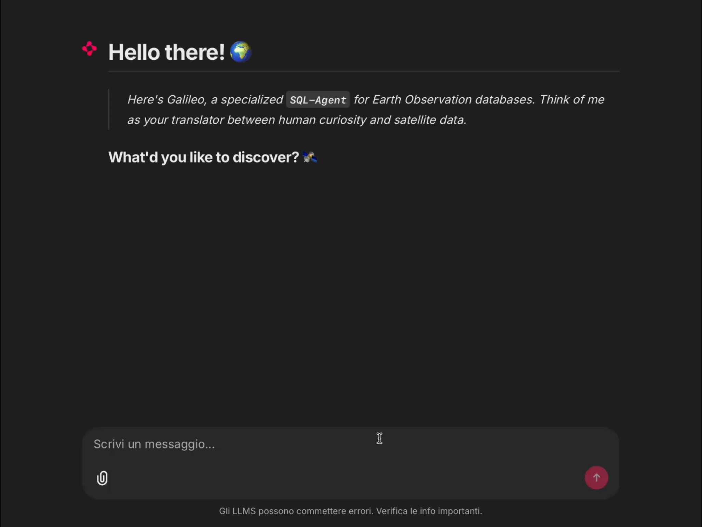

# 🪐 *Galileo* — Offline DEMO

- *“Find scenes covering Rome.”* 
The system generates spatial intersection queries using `ST_Intersects` with correct handling of spatial reference identifiers:

  

 

- *Show me the clearest images of Milan from the last three months.”* The generated SQL combines spatial filtering, temporal constraints, and cloud-cover quality metrics with correct date arithmetic.

  

 

- *All scenes within 50 km of the Rome-Florence path.”* The system constructs a geodesic line between cities and applies a metric buffer using `ST_DWithin` on the geography type.
> This is a quite long video, showing the agent's able to list even half hundreds of results.

  

 

- *“Give me the download link for the best RGB image of Vesuvius.”* The query performs spatial filtering, quality-based sorting, and joins with the `scene_assets` table to retrieve download URLs.

  

 

- *“Find scenes along Tuscan coast with less than 5% clouds.”* The generated query is able to apply coastal analysis and cloud-coverarge filtering via `PostGIS`.

  

 

- *“What's the geodesic distance Rome to Palermo vs straight line?”* Pushing to the boundaries its geometric capabilities, the agentic systems uses `ST_Distance` to compute geodesic paths along Earth's curved surface against straight lines.

  

